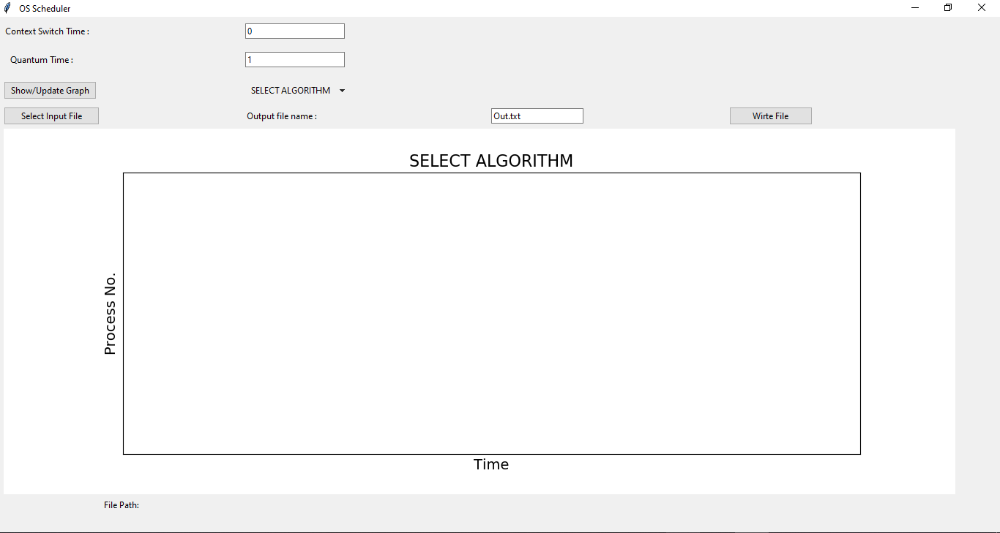
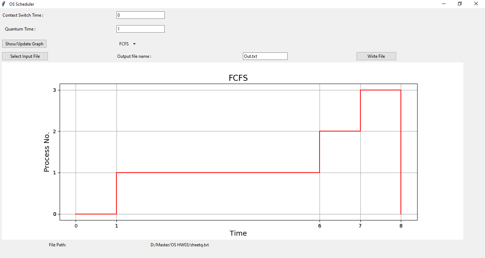
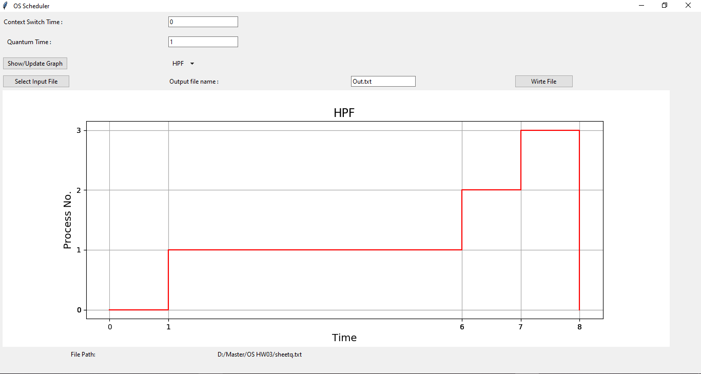
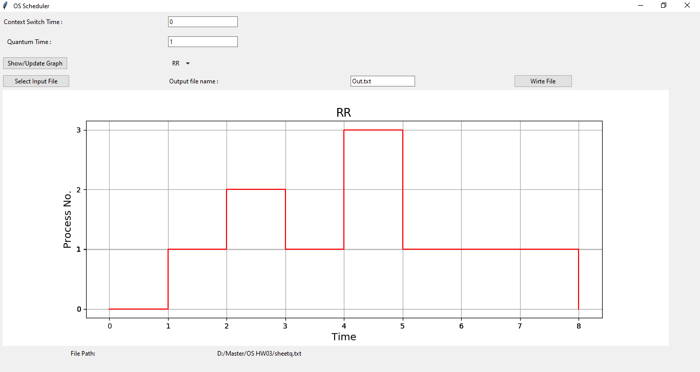
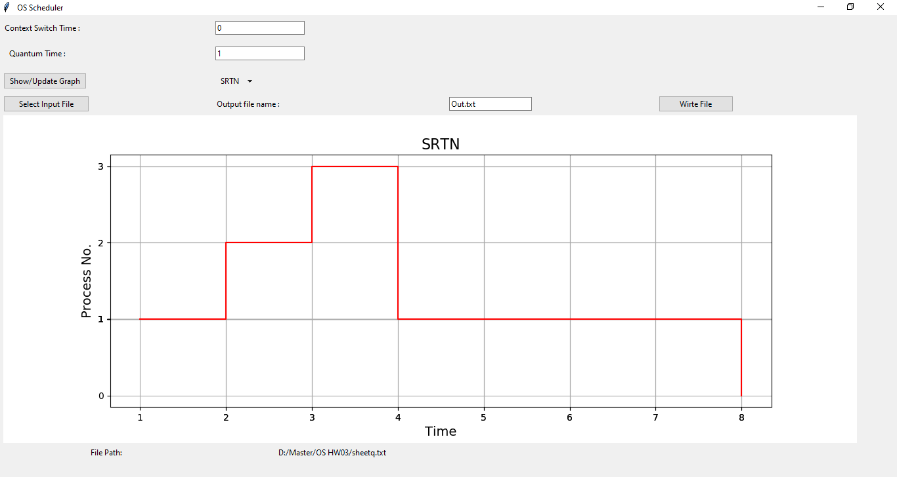

# OS-Scheduler
Operating systems scheduling algorithms visualization.
it is an OS scheduler using different scheduling algorithms
### Getting Started
These instructions will get you a copy of the project up and running on your local machine for develoment.  
pip install requirements.txt  
pip install tkinter  
python scheduler.py  

### Requirements
What things you need to install ?
- matplotlib
- tkinter
- numpy
### How to use?
NB - you must have an input file contains the process to be scheduled . its format is at docs/document file 
1.  Start the program 
2.  Choose an input file 
3.  Select the algorithm using the scrolling box .
4. Click on Show/Update Graph .

scheduler module is responsible for generating a schedule for the current processes in the system to specify the
CPU usage by these processes.
implemented 4 scheduling algorithms:
1. Non-Preemptive Highest Priority First.(HPF)
2. First Come First Served. (FCFS)
3. Round Robin with fixed time quantum.(RR)
4. Preemptive Shortest Remaining Time Next.(SRTN)

Library used for GUI : Tkinter  
Library used for plots : matplotlib  
Startup window for selecting (Input file) and (Selecting an algorithm to draw its corresponding scheduling  
The following output graphs is for inputfile at (testcases/SheetQuestion.txt)

0 indicates that the cpu is free  
-1 indicates that the context switching  

### 1. First come first served  

### 2. High priority first  

### 3. Round Robin  

### 4. Short remaining time next  

### Authors
- [@MOKHTAR](https://github.com/rrrokhtar)
